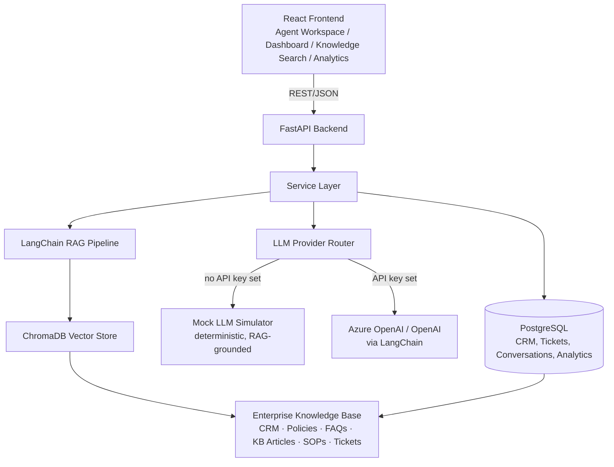

# EXLSmartAssist

**GenAI-powered Enterprise Operations Copilot for EXL** — a Microsoft-Copilot-for-Service-style AI assistant that unifies CRM records, knowledge base articles, policy documents, SOPs, and historical tickets into a single copilot for customer support agents across **Insurance, Banking, Healthcare, Retail, Travel, Utilities, and Telecom**.

This is not a chatbot. It's an enterprise operations layer: every conversation surfaces a suggested reply, a live customer summary, next-best-action recommendations, relevant SOPs and policies, compliance warnings, similar historical cases, and an escalation recommendation — all grounded in retrieved enterprise knowledge via RAG.

---

## Why this exists

Support agents across large enterprises juggle disconnected systems — CRM, a knowledge base, a policy portal, SOP wikis, and their own memory of past tickets — while a customer waits on the line. EXLSmartAssist collapses all of that into one panel that sits next to the conversation, so the agent's job becomes *verify and send* instead of *search, cross-reference, and hope*.

## Architecture



**Request flow for the Agent Workspace Copilot panel:** the frontend calls one endpoint, `GET /api/conversations/{id}/copilot`, which composes 8 AI outputs server-side (suggested reply, customer summary, next-best-action, relevant SOPs, related policies, compliance flags, similar historical cases, escalation recommendation) from the same RAG retrieval + LLM router — instead of firing 8 separate network requests.

## Tech stack

| Layer | Technology |
|---|---|
| Frontend | React 18 + TypeScript + Vite, TailwindCSS, hand-authored shadcn/ui-style primitives (Radix UI + CVA), Framer Motion, Lucide Icons, Recharts, jsPDF/html2canvas |
| Backend | Python 3.11 + FastAPI, Pydantic v2, SQLAlchemy 2.0 |
| AI / RAG | LangChain, ChromaDB, Sentence Transformers (`all-MiniLM-L6-v2`), Azure OpenAI / OpenAI (optional) |
| Database | PostgreSQL 16 |
| Auth | Mock Microsoft Entra ID login (3 demo personas) |
| Runtime | Docker Compose (Postgres + FastAPI + Vite dev server) |

## The Mock-vs-Live LLM switch

EXLSmartAssist ships with a **deterministic, RAG-grounded Mock LLM Simulator** as the default — it composes suggested replies, summaries, and CRM notes by interpolating real retrieved knowledge-base/policy/ticket text, not canned strings. This means the entire product works out of the box with **zero API keys and zero cost**.

If you set `OPENAI_API_KEY` **or** the `AZURE_OPENAI_*` variables in `.env`, the backend automatically routes every AI call through LangChain's `ChatOpenAI`/`AzureChatOpenAI` instead — no code changes, no flags. If a live call fails for any reason, it falls back to the mock simulator automatically. This routing lives entirely in `backend/app/services/llm_router.py`.

Every AI response in the UI is tagged **"Mock AI"** or **"Live AI"** so it's always clear which path served it.

## Modules

1. **Dashboard** — KPIs (AHT, active conversations, CSAT, tickets resolved), active conversations list, recent AI summaries, pending actions queue, AI insights.
2. **Agent Workspace** — center conversation panel (message history, voice input via the Web Speech API, feedback buttons) + right-hand Copilot panel: suggested reply, customer summary, next-best-action, relevant SOPs, related policies, compliance warnings, similar historical cases, escalation recommendation, and an auto call summary with a CRM note + PDF export.
3. **Enterprise Knowledge Search** — RAG search across CRM, policy documents, FAQs, KB articles, SOPs, and historical tickets, with industry/source-type filters and a PDF policy-upload dropzone that embeds new documents live.
4. **Analytics** — AHT/CSAT/FCR trend charts, most-searched policies, agent productivity table, PDF export.
5. **Compliance Checker** — every suggested reply is validated against a rule-based + policy-citation engine before it reaches the agent.

## Sample data

Hand-authored, realistic seed data for all 7 industries under `backend/app/data/seed/`: 3 CRM customers, 3 historical tickets, 2 multi-turn call transcripts, 3 KB articles, 2 FAQs, 3 clause-numbered policy documents, and 2 step-numbered SOPs — per industry.

## Demo personas (mock Entra ID)

| Username | Password | Role |
|---|---|---|
| `agent.priya` | `demo123` | Agent |
| `supervisor.daniel` | `demo123` | Supervisor |
| `admin.wei` | `demo123` | Admin |

Analytics is gated to Supervisor/Admin roles. All three are offered as one-click buttons on the login screen.

## Running it

### Option A — Docker Compose (recommended)

```bash
cp .env.example .env
docker compose up --build
```

- Frontend: http://localhost:5173
- Backend API: http://localhost:8000 (docs at `/docs`)
- Postgres: `localhost:5433` on the host (mapped off the default 5432 to avoid clashing with a local Postgres install; override with `POSTGRES_HOST_PORT` in `.env`). The backend always talks to Postgres over the internal Docker network on port 5432, so this only matters if you want to connect a host client (e.g. `psql`) directly.

The backend container seeds Postgres and builds the Chroma vector index automatically on first boot (idempotent — safe to restart).

### Option B — Manual (venv + npm)

```bash
# Backend
cd backend
python3 -m venv .venv && source .venv/bin/activate
pip install -r requirements.txt
python -m app.scripts.seed_db
python -m app.scripts.build_vector_index
uvicorn app.main:app --reload --port 8000

# Frontend (separate terminal)
cd frontend
npm install
npm run dev
```

By default the backend uses SQLite-free Postgres via `DATABASE_URL` in `.env.example` — for local manual runs without Docker, point `DATABASE_URL` at a local Postgres instance, or use `sqlite:///./exlsmartassist.db` for a zero-setup local run.

### Enabling a live LLM (optional)

Add to `.env`:

```bash
OPENAI_API_KEY=sk-...
OPENAI_MODEL=gpt-4o-mini
```

or for Azure OpenAI:

```bash
AZURE_OPENAI_API_KEY=...
AZURE_OPENAI_ENDPOINT=https://your-resource.openai.azure.com/
AZURE_OPENAI_DEPLOYMENT=your-deployment-name
```

Restart the backend — no other changes needed.

## API reference

All routes are prefixed with `/api`.

| Method | Path | Purpose |
|---|---|---|
| `POST` | `/chat` | Suggested reply for a customer message + conversation history |
| `POST` | `/summarize` | Structured call summary (issue, root cause, actions, resolution, follow-up) |
| `POST` | `/next-action` | Ranked next-best-action list + escalation recommendation |
| `POST` | `/knowledge-search` | RAG search across CRM/policy/FAQ/KB/SOP/ticket sources |
| `POST` | `/knowledge-search/upload-policy` | Upload + embed a policy PDF |
| `POST` | `/crm-note` | Generate a formatted CRM note from a transcript |
| `POST` | `/compliance-check` | Validate a draft response against policy rules |
| `GET` | `/dashboard` | KPIs, active conversations, recent summaries, pending actions, AI insights |
| `GET` | `/analytics` | AHT/CSAT/FCR trends, top policies, agent productivity |
| `GET/POST` | `/conversations`, `/conversations/{id}` | Conversation list/detail backing the Agent Workspace |
| `GET` | `/conversations/{id}/copilot` | The full 8-part Copilot bundle for one conversation |
| `POST` | `/feedback` | Thumbs up/down on an AI suggestion |
| `POST` | `/auth/login`, `GET` | `/auth/demo-users` — mock Entra ID login |

## Demo script

1. Log in as `supervisor.daniel` to see the Analytics nav item.
2. Open **Agent Workspace**, pick a seeded Banking conversation — watch the Copilot panel populate all 8 sections.
3. Edit the suggested reply, click **Send to Customer**, then generate the **Summary & CRM Note** tab and export it as a PDF.
4. Go to **Knowledge Search**, search "claim denial" filtered to Insurance, then drag-and-drop a policy PDF to see it get embedded live.
5. Open **Analytics**, export the dashboard as a PDF, then toggle dark mode from the top bar.

All of the above works with zero API keys configured — the default judged path uses the Mock LLM Simulator end-to-end.

## Project structure

```
project-main/
├── backend/            # FastAPI + LangChain + ChromaDB + PostgreSQL
│   ├── app/
│   │   ├── api/routes/     # One router per endpoint group
│   │   ├── services/       # LLM router, RAG pipeline, compliance/NBA engines
│   │   ├── models/         # SQLAlchemy ORM models
│   │   ├── schemas/        # Pydantic request/response models
│   │   ├── data/seed/      # Per-industry sample data (JSON)
│   │   └── scripts/        # seed_db.py, build_vector_index.py
│   └── tests/
├── frontend/            # React + TypeScript + Vite + Tailwind
│   └── src/
│       ├── pages/           # Dashboard, Workspace, KnowledgeSearch, Analytics, Login
│       ├── components/      # ui/, layout/, dashboard/, workspace/, knowledge/, analytics/
│       └── lib/              # api.ts, auth.tsx, theme.tsx, utils.ts
├── docker-compose.yml
└── .env.example
```
